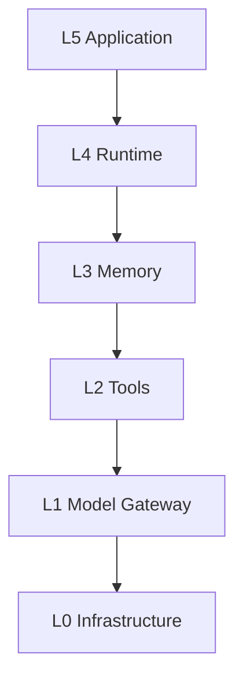
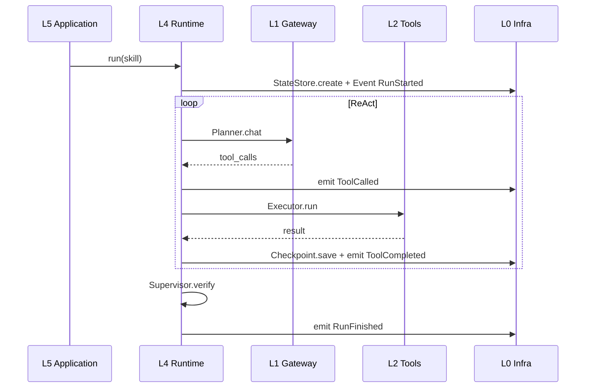

# 00 — 架构总览

## 一句话

**GeeGoo Agent** 是股票分析专用的自托管 Agent 操作系统：

```text
Agent = Agent Runtime + Infrastructure Layer
```

- **Runtime（L4）**：Planner + Executor + StateMachine + WorkflowEngine
- **Infrastructure（L0）**：EventBus、StateStore、Checkpoint、Scheduler 等——决定能否**长时运行、可恢复、可扩展**

## 工程六层

```text
┌─────────────────────────┐
│ L5 Application          │  Skill、CLI/chat、触发模式
└───────────┬─────────────┘
            ▼
┌─────────────────────────┐
│ L4 Agent Runtime        │  Planner · Executor · WorkflowEngine · StateMachine
└───────────┬─────────────┘
            ▼
┌─────────────────────────┐
│ L3 Context / Memory     │  Session · Working · Episodic · Semantic
└───────────┬─────────────┘
            ▼
┌─────────────────────────┐
│ L2 Tool & MCP Layer     │  ToolRegistry · GeeGoo Clients
└───────────┬─────────────┘
            ▼
┌─────────────────────────┐
│ L1 Model Gateway        │  限流 · Fallback · Cost
└───────────┬─────────────┘
            ▼
┌─────────────────────────┐
│ L0 Infrastructure       │  EventBus · Scheduler · Checkpoint · ...
└─────────────────────────┘
```



## 与 Hermes / Claude Code 对照

| 维度   | Hermes   | Claude Code    | GeeGoo Agent               |
| ---- | -------- | -------------- | ------------------------ |
| 扩展   | Skill 目录 | Rules + Tools  | Skill Pack + Rules       |
| 循环   | 隐式       | 显式 Loop        | ReAct + max_steps        |
| 工具   | 隐式 shell | Read/Bash/Grep | GeeGoo Typed Tools（无 Bash） |
| 记忆   | 对话+日志    | 上下文+Grep      | 四层 Memory（MVP 无向量库）   |
| 持久化  | 文件+日志    | 无 Agent 侧 DB   | FileStateStore + 本地报告 md |
| 向量库  | 无        | 无              | Phase 4+ 可选；MVP 不需要    |
| 子代理  | 弱        | Subagent       | StockAnalyst 等           |
| 质检   | 无        | 用户确认           | Supervisor + Schema      |
| 基础设施 | 隐式       | 部分显式           | **独立 L0 层**              |

## 双 Skill 来源

| Skill        | 用途             | 触发            |
| ------------ | -------------- | ------------- |
| `geegoo` | 盘前/盘后/盘中报告工作流  | 定时 / webhook  |
| `geegoo`       | 按需分析、策略、Bot 管理 | chat（Bot 需确认） |

详见 [domains/](./domains/)。

## 外部依赖（数据库 / 向量库 / Embedding）

**盘前 MVP 零外部 DB**：不需 PostgreSQL、Redis、Chroma、Milvus 或 embedding 服务。

| 类型 | MVP | 说明 |
|------|-----|------|
| Agent 状态 | `FileStateStore` | session / working / checkpoint，见 [state-store.md](./L0-infrastructure/state-store.md) |
| 跨日记忆 | 本地 `md` + `jsonl` | Episodic；见 [episodic-memory.md](./layers/L3-memory/episodic-memory.md) |
| 业务数据 | GeeGoo HTTP API | 报告、Bot、行情在远端服务（MongoDB 等由 GeeGoo 运维，Agent 不直连） |
| 向量检索 | stub | `SemanticMemory.search()` 返回空，Phase 4+ 再评估 |

Hermes 与 Claude Code 同样**不为 Agent 运行时配向量库**——前者靠文件与 API，后者靠上下文与 Grep。GeeGoo Agent 遵循同一轻量原则，仅在需要「相似历史盘面」时再引入向量栈。

完整分阶段决策表与方案对比见 [layers/L3-memory/README.md §外部依赖决策](./layers/L3-memory/README.md#外部依赖决策数据库--向量库--embedding)。

## 核心原则

1. **LLM 编排，Tool 执行** — 禁止 Agent 手写 HTTP / 任意 shell
2. **Runtime 不直连模型** — 必须经 L1 Model Gateway
3. **事件驱动** — Tool 完成通过 EventBus 驱动下一 Plan 步
4. **每步 Checkpoint** — API 超时从当前 step 恢复
5. **定时模式不加载 Bot CRUD** — 防无人值守误操作
6. **接口先行** — 每层 Protocol 抽象，MVP 轻量实现可替换

## Phase 0 基础设施四件套（最高优先级）

| P0  | 模块         | 文档                                                                     |
| --- | ---------- | ---------------------------------------------------------------------- |
| ✓   | EventBus   | [L0-infrastructure/event-bus.md](./L0-infrastructure/event-bus.md)     |
| ✓   | StateStore | [L0-infrastructure/state-store.md](./L0-infrastructure/state-store.md) |
| ✓   | Checkpoint | [L0-infrastructure/checkpoint.md](./L0-infrastructure/checkpoint.md)   |
| ✓   | Scheduler  | [L0-infrastructure/scheduler.md](./L0-infrastructure/scheduler.md)     |

## 一次 Run 生命周期（简图）



## 不是什么

- 不是 Airflow 式确定性 pipeline
- 不是 Hermes 式超长 cron prompt
- 不是自动交易执行系统（MVP 不自动下单）
- 不是 Coding Agent（无 Dev Container / 任意 Bash）

