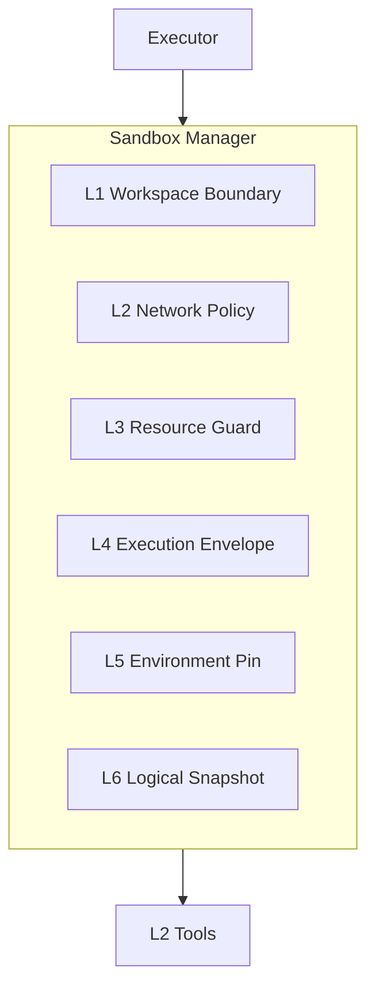
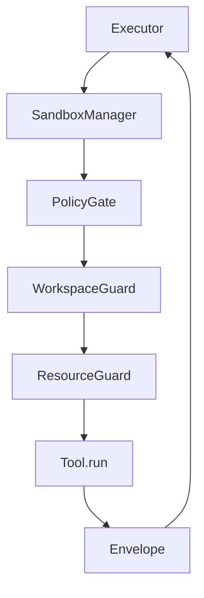

# L0 — Sandbox（Agent 的执行身体）

> **定位**：Sandbox 不是 Tool 的子模块，而是与 Runtime 平级的**一级基础设施**。  
> Runtime 是大脑；Sandbox 是 Agent 在真实世界里动手时穿的「防护服 + 工作间」。

```text
LLM → Runtime (Planner/Executor) → Sandbox Manager → 真实环境 (GeeGoo API / 文件 / 新闻源)
```

Coding Agent 里 Sandbox 跑 shell；GeeGoo Agent 里 Sandbox 跑 **Typed Tool**——原则相同：**所有副作用必须经过 Sandbox，不能由 Runtime 直连外部世界**。

---

## 为什么 GeeGoo Agent 也需要 Sandbox

我们**不提供** `run_shell()`，但 Tool 仍能：

- 向 GeeGoo API **写入**盘前报告（`create_pre_market_report`）
- 读取**错误端口**或**错误凭证**导致异常调用
- 拉新闻脚本访问**任意外网**
- `save_local_report` 若路径不受限，可写满磁盘或写到 `/etc`

若无 Sandbox：

```text
Agent = 持有 mk-/sk- API Key 的无人值守 Root 机器人
```

因此：**没有 Sandbox，Agent 不敢在生产跑**——与 Coding Agent 同理，只是威胁模型不同。

---

## 六大职责（对齐通用模型，GeeGoo 落地方式）


| 职责       | Coding Agent 典型实现     | GeeGoo Agent 实现                         |
| -------- | --------------------- | ------------------------------------- |
| **隔离**   | Docker 容器 / workspace | Tool 白名单 + Session 工作区路径隔离            |
| **权限控制** | 只读/读写挂载               | 按 RunMode 过滤 Tool；定时模式禁 Bot CRUD      |
| **资源限制** | cgroup CPU/内存         | 单 Tool 超时、返回体大小上限、并发上限                |
| **环境管理** | Python3.10/3.12 多镜像   | 单 venv + `EnvManager` profile（非多语言栈）  |
| **状态管理** | Workspace 文件树         | `output_dir/{date}/` + StateStore 键空间 |
| **可恢复**  | ZFS/Docker 层快照        | **Checkpoint**（逻辑快照，非文件系统快照）          |


---

## 六层 Sandbox 模型（GeeGoo 适配版）

Coding Agent 常用六层；GeeGoo Agent **保留分层思想**，实现按领域裁剪。




### L1 — Workspace Boundary（文件系统沙箱）

**Coding**：只能看 `/workspace`。  
**GeeGoo**：Agent 文件世界只有 **Session 工作区**：

```text
{output_dir}/{YYYYMMDD}/
  sessions/
  working/
  checkpoints/
  artifacts/
  execution-log.md
  {code}-premarket.md
```

规则：

- `save_local_report` 路径必须在 `{output_dir}/{date}/` 下（禁止 `../`、绝对路径写 `/etc`）
- StateStore 所有 key 必须在 `output_dir` 根下
- **不暴露** `read_file` / `write_file` 通用 Tool——只有受控的 `save_local_report`

MVP：路径校验函数 `assert_in_workspace(path)`。  
后期：可选独立 Linux user + 目录 chown（仍不必整容器）。

### L2 — Network Policy（网络沙箱）

**Coding**：断网 / 白名单 github+pypi。  
**GeeGoo**：HTTP 只允许访问**业务必需**端点：


| 级别          | 策略         | MVP                                                       |
| ----------- | ---------- | --------------------------------------------------------- |
| **Level 0** | 仅 GeeGoo API | 5900 + 5700 主机                                            |
| **Level 1** | + 新闻源      | eastmoney、sina、CNBC RSS 等（配置 allowlist）                   |
| **Level 2** | + LLM API  | `api.openai.com`、`api.anthropic.com`（走 Gateway，非 Tool 直连） |
| **Level 3** | 企业扩展       | 飞书 webhook、内部行情（配置）                                       |


实现：`clients/base.py` 内 `AllowedHostHTTPAdapter` 或显式 host 校验；新闻脚本禁止任意 URL 参数。

```python
NETWORK_ALLOWLIST = [
  "118.195.135.97",      # GeeGoo
  "finance.eastmoney.com",
  "api.openai.com",
  ...
]
```

**没有** `run_shell` → 不存在 `curl | bash` 类攻击面；风险集中在 **HTTP Client 与新闻脚本**。

### L3 — Resource Guard（资源沙箱）


| 限制项                  | 默认值     | 说明                        |
| -------------------- | ------- | ------------------------- |
| `tool_timeout`       | 120s    | `get_mcp_analysis` 可 180s |
| `max_result_bytes`   | 1MB     | 超出截断，全文进 artifacts 文件     |
| `max_steps`          | 80      | Runtime 级，Sandbox 记录      |
| `max_parallel_tools` | 1（MVP）  | 后期指数并行时 = 5               |
| `session_disk_quota` | 500MB/日 | 可选                        |


防止：新闻脚本死循环、巨型 analysis 撑爆内存、磁盘写满。

实现：`concurrent.futures` + timeout；结果 size check。

### L4 — Execution Envelope（执行沙箱）

**Coding**：`pytest` → `{stdout, stderr, exit_code}`。  
**GeeGoo**：每个 Tool 返回统一 **ToolResult**（Sandbox 包装，Executor 只认此格式）：

```python
@dataclass
class ToolResult:
    status: Literal["ok", "error", "skipped", "dry_run"]
    summary: str              # 给 LLM 的摘要
    data: dict | None         # 结构化字段
    exit_code: int            # 0=ok, 非0=业务/HTTP错误
    stdout_ref: str | None    # 大输出文件指针
    stderr: str | None
    latency_ms: int
    sandbox_layer: str | None # 哪层拦截：network/workspace/resource
```

Runtime 看到 `exit_code != 0` 可决定重试/降级/跳过——与 Claude Code 看测试失败再继续修一样。

### L5 — Environment Pin（环境沙箱）

**Coding**：Project A Python3.10 / Project B 3.12 + Docker 镜像。  
**GeeGoo**：**单应用单 venv**，不需要多语言栈：

- `pyproject.toml` 锁定依赖
- `EnvManager` profile：`dev` / `prod` 仅差路径与日志级别
- 新闻脚本作为**固定子进程**（若用 subprocess），`cwd` 与 `PYTHONPATH` 固定，不接受 Agent 传入

不做 Dev Container；若未来跑 untrusted 新闻爬虫，可选 **轻量 Docker 只包 news 脚本**（Phase 6+），与主进程隔离。

### L6 — Logical Snapshot（快照 / 可恢复）

**Coding**：OverlayFS / `git checkout` 恢复 workspace。  
**GeeGoo**：**没有代码树可回滚**；可回滚的是 **Agent 状态**：

```text
Checkpoint step 87  ≈  Snapshot C
rollback()          ≈  geegoo-agent resume <session_id>
```


| Coding Snapshot | GeeGoo 等价物                         |
| --------------- | -------------------------------- |
| 文件树回滚           | 不适用（无任意写文件）                      |
| 执行进度回滚          | `Checkpoint` + `StateStore`      |
| 对话上下文回滚         | `SessionMemory` archive + resume |


这是 **Logical Snapshot**，不是 Docker Layer；与 [checkpoint.md](./checkpoint.md) 同一套设施。

---

## Sandbox Manager 架构

```text
Executor
    │
    ▼
SandboxManager.execute(tool_call, ctx)
    │
    ├── 1. PolicyGate      # 白名单 + RunMode + dry_run
    ├── 2. WorkspaceGuard  # 路径校验（文件类 Tool）
    ├── 3. NetworkGuard    # HTTP host allowlist（Client 层）
    ├── 4. ResourceGuard   # timeout + size + quota
    ├── 5. Tool.run()      # 实际执行
    └── 6. Envelope.wrap() # 统一 ToolResult + Tracing span
```




**代码包**（MVP 可单文件，后期拆分）：

```text
src/geegoo/infra/sandbox/
├── manager.py       # SandboxManager 入口
├── policy.py        # L1 白名单 + mode
├── workspace.py     # L1 路径
├── network.py       # L2 allowlist（也可在 clients  enforce）
├── resource.py      # L3 超时/大小
└── envelope.py      # L4 ToolResult
```

---

## 多 Agent 的 Sandbox 隔离

**不要**多个 Subagent 共享同一 `WorkingMemory` 写集。

```text
Orchestrator Session
    │
    ├── spawn StockAnalyst(00700.HK)
    │       └── sub_session_id + 独立 working 命名空间
    │           tools ⊆ {analysis, report}
    │
    └── spawn NewsCollector
            └── sub_session_id
                tools ⊆ {fetch_*_news}
```

- 每个 Subagent：`sandbox_id = f"{parent_session}:{agent_type}:{target}"`
- 汇总时只回传 **summary**，不回传全文 artifact
- 等价于 Coding 的「Sandbox A / B / C 不共享 workspace」

---

## 与「不用 Docker」的决策


| 论点                   | 回应                                                                  |
| -------------------- | ------------------------------------------------------------------- |
| Claude Code 用 Docker | 因为要跑任意 shell；GeeGoo **禁止 shell**                                      |
| 没有 Docker 就不安全       | 威胁模型是 **API 误用 + HTTP 外泄 + 路径穿越**，用六层逻辑沙箱覆盖                         |
| 以后要不要 Docker         | Phase 6+ 可选：仅隔离 **news subprocess** 或 **bot_manager 交互式** 会话，非全盘容器化 |


**结论**：GeeGoo Sandbox 是 **「Typed-Tool OS」**，不是微型 Docker Desktop；但在架构层级上与 Claude Code Sandbox **同级**。

---

## MVP 实现范围（Phase 0-1）


| 层              | MVP                             | 后期              |
| -------------- | ------------------------------- | --------------- |
| L1 Workspace   | `save_local_report` 路径校验        | chown 专用用户      |
| L2 Network     | GeeGoo IP + 新闻域名 allowlist        | 配置化 per profile |
| L3 Resource    | timeout + max_result_bytes      | disk quota      |
| L4 Envelope    | 统一 ToolResult                   | 丰富 exit_code 枚举 |
| L5 Environment | 单 venv，固定脚本路径                   | Docker 仅 news   |
| L6 Snapshot    | 依赖 Checkpoint（已有）               | —               |
| PolicyGate     | Tool 白名单 + scheduled 禁 Bot CRUD | per-skill 细粒度   |


**不实现**：通用 Shell、任意读写文件、全容器 workspace。

---

## 接口（SandboxManager）

```python
class SandboxManager:
    def __init__(
        self,
        policy: PolicyGate,
        workspace: WorkspaceGuard,
        resource: ResourceGuard,
        network: NetworkPolicy,  # 注入 clients
        tracer: TraceContext,
    ): ...

    def execute(
        self,
        tool: BaseTool,
        call: ToolCall,
        ctx: ToolContext,
    ) -> ToolResult:
        self.policy.check(call, ctx.mode)
        self.workspace.check(call, ctx)
        with self.resource.limit(tool.timeout):
            raw = tool.run(...)
        return self.envelope.wrap(raw, call)
```

Executor **只**调 `SandboxManager.execute`，不直接 `tool.run()`。

---

## 设计思路总结（一句话）

**用「Tool 白名单 + 工作区边界 + 网络 allowlist + 资源上限 + 统一执行信封」实现 Coding Agent 级 Sandbox 的六大职责；用 Checkpoint 替代文件系统快照；不按 Docker 堆栈，是因为 GeeGoo Agent 的「身体」是 API 与报告，不是 shell。**

相关文档：

- [checkpoint.md](./checkpoint.md) — L6 可恢复
- [env-manager.md](./env-manager.md) — L5 环境
- [../layers/L2-tools/sandbox-integration.md](../layers/L2-tools/sandbox-integration.md) — Executor 集成

