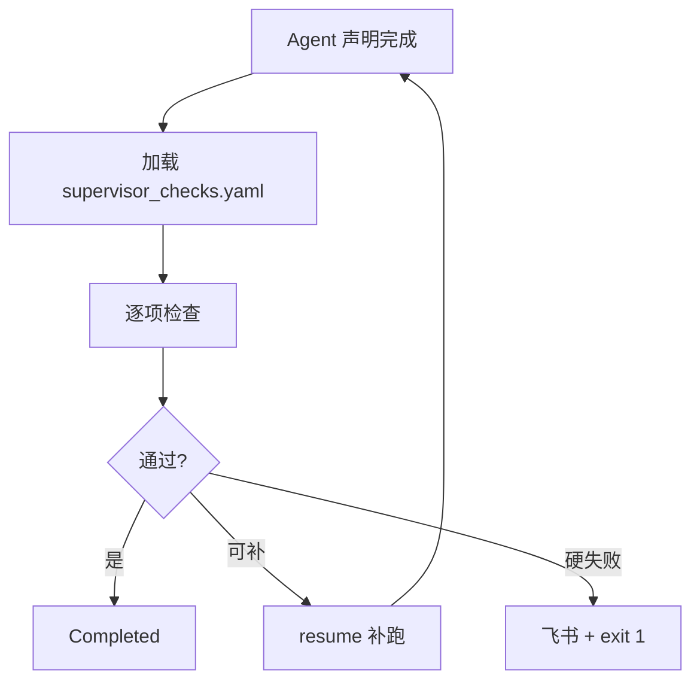

# Supervisor（横切）

## 职责

Agent 声明完成后，**确定性验收**——弥补 Hermes「跑完没人检查」。

## 流程

## checks.yaml 类型

| type                     | 说明                      |
| ------------------------ | ----------------------- |
| `execution_log_contains` | 日志含关键字                  |
| `stocks_status`          | WorkingMemory 每股 status |
| `api_response`           | create_report 字段        |
| `file_exists`            | 本地 md 存在                |

## 盘前示例

见 `skills/pre_market/supervisor_checks.yaml`（实现时创建）。

## 代码

`src/geegoo/supervisor/engine.py`, `checks.py`

## MVP

全部 check 类型 + 单次补跑 resume。