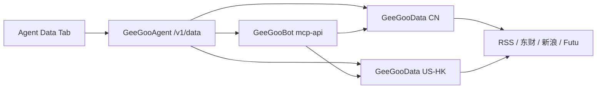

# 股票数据模块 — BFF API 与 Agent Data Tab 设计（SSOT）

> **状态**：已采纳，待实现  
> **分工**：GeeGooData 实现数据；GeeGooAgent BFF 聚合；`trading_operation/agent_mode` 统一管理 UI  
> 相关：[geegoodata-news.md](./domains/geegoodata-news.md) · [dashboard-platform.md](./dashboard-platform.md) · [agent-mode-waku-design.md](./agent-mode-waku-design.md)

## 1. 目标

运营在 **Agent 模式** 内一站式查看股票数据链路状态，无需 SSH 或直连 GeeGooData。

| 能力 | 归属 | 本设计范围 |
|------|------|-----------|
| 多源采集、缓存、去重 | GeeGooData | 消费已有 `/v1/*` |
| MCP 契约、按 code 路由 | GeeGooBot | doctor 探针复用 |
| 聚合多节点、藏 token | GeeGooAgent BFF | **新增 `/v1/data/*`** |
| Data Tab UI | trading_operation | **新增 Nav + View** |

**非目标**：浏览器直连 GeeGooData；在 Flutter 写爬虫；用 UI 替代 git deploy 改 XML。

## 2. 架构

```text
trading_operation/agent_mode
  AgentDataView  ──GET──►  GeeGooAgent :3400 /v1/data/*
                                    │
                    ┌───────────────┼───────────────┐
                    ▼               ▼               ▼
              GeeGooData CN    GeeGooData US-HK   GeeGooBot :3120
              82.157:3300      47.80:3300         (tool 探针)
```



鉴权与现有 Cockpit 一致：

- `Authorization: Bearer <GEEGOO_AGENT_RUNTIME_API_KEY>`
- 写探针（可选）：`X-MCP-Token: <user_mcp_token>`

浏览器**不**持有 `GEEGOO_DATA_SERVICE_TOKEN`；BFF 从 Agent 配置/环境变量读取。

## 3. 多节点配置（GeeGooAgent）

在 `config.json` / 环境变量声明 Data 节点（与 Bot 路由对齐）：

```json
{
  "data_base_url": "http://127.0.0.1:3300",
  "data_nodes": [
    {
      "id": "ashare-cn",
      "label": "A股节点",
      "base_url": "http://82.157.97.76:3300",
      "regions": ["CN"],
      "bearer_env": "GEEGOO_DATA_CN_TOKEN"
    },
    {
      "id": "us-hk",
      "label": "港美节点",
      "base_url": "http://47.80.14.120:3300",
      "regions": ["US", "HK"],
      "bearer_env": "GEEGOO_DATA_USHK_TOKEN"
    }
  ]
}
```

| 字段 | 说明 |
|------|------|
| `id` | 稳定标识，UI 与探针结果引用 |
| `base_url` | GeeGooData `data-api` 根 URL |
| `regions` | 展示用；与 `market_capabilities.xml` 一致 |
| `bearer_env` | 可选；未设则回退 `GEEGOO_DATA_SERVICE_TOKEN` |

单节点部署时仅配置 `data_base_url`（现有行为）；`data_nodes` 为空则合成一个 `default` 节点。

## 4. BFF API 契约

路由注册于 `internal/runtimeapi/data.go`（与 `dashboard.go` 并列）。

### 4.1 `GET /v1/data/overview`

聚合各节点健康、能力、新闻源计数。供 Data Tab 首屏与 Overview 架构图节点着色。

**响应**

```json
{
  "ok": true,
  "checked_at": "2026-07-26T06:51:00Z",
  "nodes": [
    {
      "id": "ashare-cn",
      "label": "A股节点",
      "base_url": "http://82.157.97.76:3300",
      "regions": ["CN"],
      "health": {
        "ok": true,
        "latency_ms": 42,
        "detail": "HTTP 200"
      },
      "futu": {
        "ok": true,
        "host": "127.0.0.1",
        "port": 11111
      },
      "capabilities": {
        "regions": ["CN"],
        "quote": true,
        "capital_flow": true,
        "news": true
      },
      "news": {
        "enabled_sources": 3,
        "healthy_sources": 2,
        "cache_market_ttl_sec": 600,
        "cache_stock_ttl_sec": 300
      }
    }
  ],
  "routing": {
    "bot_mcp_url": "http://127.0.0.1:3120",
    "bot_ok": true
  },
  "summary": {
    "nodes_total": 2,
    "nodes_healthy": 2,
    "sources_total": 8,
    "sources_healthy": 7
  }
}
```

**实现要点**

- 并行 `GET {node}/health`、`GET {node}/v1/market/capabilities`、`GET {node}/v1/news/sources`
- 可选 `GET {node}/v1/futu/health`、`GET {node}/v1/news/health`
- 单节点失败不阻断整包；`ok=false` 且 `summary` 反映降级

### 4.2 `GET /v1/data/nodes`

节点列表与静态元数据（不探活）。用于 Settings 展示与缓存键。

**Query**

| 参数 | 默认 | 说明 |
|------|------|------|
| `probe` | `false` | `true` 时附带与 overview 相同的 health 块 |

**响应**

```json
{
  "nodes": [
    {
      "id": "ashare-cn",
      "label": "A股节点",
      "base_url": "http://82.157.97.76:3300",
      "regions": ["CN"],
      "source_file": "config/news_sources.cn.xml"
    }
  ]
}
```

### 4.3 `GET /v1/data/nodes/{id}/news/sources`

代理 GeeGooData `GET /v1/news/sources`。

**响应**：与 Data 原生一致，增加 BFF 包装：

```json
{
  "node_id": "ashare-cn",
  "server_id": "ashare-cn",
  "regions": {
    "CN": {
      "sources": [
        {"id": "eastmoney_sector", "enabled": true, "label": "东方财富·板块聚焦"}
      ]
    }
  },
  "cache_market_ttl_sec": 600,
  "cache_stock_ttl_sec": 300,
  "source_file": "config/news_sources.cn.xml"
}
```

### 4.4 `GET /v1/data/nodes/{id}/news/health`

代理 `GET /v1/news/health`。

```json
{
  "node_id": "ashare-cn",
  "server_id": "ashare-cn",
  "sources": [
    {
      "id": "eastmoney_sector",
      "label": "东方财富·板块聚焦",
      "ok": true,
      "latency_ms": 380,
      "detail": "200 OK",
      "last_checked": "2026-07-26T06:50:55Z"
    }
  ]
}
```

### 4.5 `GET /v1/data/nodes/{id}/market/capabilities`

代理 `GET /v1/market/capabilities`。

### 4.6 `POST /v1/data/probe`

端到端探针：经 **Bot MCP** 或 **直连 Data** 拉样本，验证 Agent Tool 链路。

**请求**

```json
{
  "checks": ["market_news", "stock_news", "quote", "capital_flow"],
  "market": "CN",
  "code": "600519.SH",
  "limit": 3
}
```

| `checks` 值 | 路径 | 说明 |
|-------------|------|------|
| `market_news` | Bot `/getMarketNews` 或 Data `/v1/news/market` | 盘前三市场 |
| `stock_news` | Bot `/getStockNews` 或 Data `/v1/news/stock` | 需 `code` |
| `quote` | Bot `getCurrentPrice` | 现价 |
| `capital_flow` | Bot `getCapitalFlow` | 需 `code` |

**响应**

```json
{
  "ok": true,
  "results": [
    {
      "check": "market_news",
      "ok": true,
      "path": "bot",
      "latency_ms": 520,
      "item_count": 3,
      "sources_used": ["eastmoney_sector", "sina_roll"],
      "detail": "CN market news OK"
    }
  ]
}
```

与 `internal/doctor/toolprobes.go` 对齐；成功后 Data Tab「一键探针」与 Ops doctor 共用实现。

### 4.7 `GET /v1/dashboard/data` 增量（可选 Phase 2）

在现有 `buildDashboardData` 中嵌入精简块，避免首屏双请求：

```json
{
  "data_fleet": {
    "ok": true,
    "nodes_healthy": 2,
    "nodes_total": 2
  }
}
```

完整明细仍走 `/v1/data/overview`。

## 5. BFF 实现要点（GeeGooAgent）

```
internal/runtimeapi/
  data.go           # 路由 + handler
  data_collect.go   # 并行探活、超时、降级
  data_probe.go     # POST /v1/data/probe
internal/config/
  data_nodes.go     # DataNodes 解析与 env bearer
```

| 规则 | 说明 |
|------|------|
| 超时 | 单节点 8s；overview 总超时 12s |
| 缓存 | 内存 30s TTL（可配置 `GEEGOO_DATA_BFF_CACHE_SEC`） |
| 错误 | 节点级 `health.ok=false` + `detail`；不 500 整包 |
| 日志 | 不打印 bearer；探针结果可写 trace |

## 6. trading_operation — Data Tab 设计

### 6.1 导航

在 `AgentNavView` 增加 `data`，位于 `tools` 与 `database` 之间：

```dart
enum AgentNavView {
  // ...
  tools,
  data,      // 新增
  database,
  // ...
}
```

| 属性 | 值 |
|------|-----|
| `label` | `Data` |
| `group` | `System` |
| `icon` | `Icons.cloud_sync_outlined` |
| `hash` | `#data` / `#data/news` / `#data/probe` |

`navBadges[data]`：任一节点 `health.ok == false` 时显示 `1`。

### 6.2 页面线框

```
┌─────────────────────────────────────────────────────────────────┐
│ Data — 股票数据链路                                    [刷新]    │
├─────────────────────────────────────────────────────────────────┤
│ 子 Tab:  [ 总览 ]  [ 新闻源 ]  [ 行情能力 ]  [ 探针 ]            │
├─────────────────────────────────────────────────────────────────┤
│                                                                 │
│  ▼ 总览 (sub=overview)                                          │
│  ┌──────────────┐ ┌──────────────┐                              │
│  │ A股节点  ●   │ │ 港美节点  ●  │   ← 绿/黄/红 health          │
│  │ CN · 42ms    │ │ US,HK · 58ms │                              │
│  │ 源 3/3  OK   │ │ 源 5/5  OK   │                              │
│  └──────────────┘ └──────────────┘                              │
│  Bot MCP :3120  ●  路由正常                                      │
│  [ 架构图中高亮 GeeGooData 节点 ]                                │
│                                                                 │
│  ▼ 新闻源 (sub=news)                                            │
│  节点 [ A股 ▼ ]                                                 │
│  ┌─────────────────────────────────────────────────────────┐   │
│  │ 源 ID          │ 市场 │ 启用 │ 探活 │ 延迟 │ 说明        │   │
│  │ eastmoney_sec  │ CN   │  ✓   │  ✓   │ 380ms│ 板块聚焦    │   │
│  │ sina_roll      │ CN   │  ✓   │  ✓   │ 120ms│ 新浪 roll   │   │
│  └─────────────────────────────────────────────────────────┘   │
│  缓存: 市场 600s · 个股 300s · 配置文件 news_sources.cn.xml      │
│                                                                 │
│  ▼ 行情能力 (sub=capabilities)                                  │
│  节点 [ 港美 ▼ ]                                                │
│  Regions: US, HK  ·  Quote ✓  ·  Capital ✓  ·  News ✓          │
│  Futu OpenD: 127.0.0.1:11111 ●                                  │
│                                                                 │
│  ▼ 探针 (sub=probe)                                             │
│  市场 [ CN ▼ ]  代码 [ 600519.SH ]                              │
│  ☑ market_news  ☑ stock_news  ☑ quote  ☐ capital_flow          │
│  [ 运行探针 ]                                                   │
│  ┌─ 结果 ─────────────────────────────────────────────────┐    │
│  │ ✓ market_news  bot  520ms  3 items  eastmoney,sina     │    │
│  │ ✓ stock_news   bot  410ms  3 items                     │    │
│  └────────────────────────────────────────────────────────┘    │
└─────────────────────────────────────────────────────────────────┘
```

### 6.3 Flutter 模块结构

```
trading_operation/lib/modules/agent_mode/
  models/data_fleet.dart          # 解析 /v1/data/overview
  controllers/data_fleet_controller.dart  # 或扩展现有 AgentModeController
  views/agent_data_view.dart
  widgets/data_node_cards.dart
  widgets/data_news_sources_table.dart
  widgets/data_probe_panel.dart
lib/api/agent_runtime_server.dart   # fetchDataOverview(), probeData(), ...
```

### 6.4 数据模型（对齐 `dashboard_data.dart` 风格）

```dart
class DataFleetOverview {
  final bool ok;
  final DateTime? checkedAt;
  final List<DataNodeStatus> nodes;
  final DataFleetSummary summary;
  // factory fromJson(Map<String, dynamic> json)
}

class DataNodeStatus {
  final String id;
  final String label;
  final List<String> regions;
  final bool healthOk;
  final int? latencyMs;
  final int enabledSources;
  final int healthySources;
}

class DataNewsSourceRow {
  final String id;
  final String label;
  final String market;
  final bool enabled;
  final bool probeOk;
  final int? latencyMs;
}
```

### 6.5 交互规则

| 操作 | 行为 |
|------|------|
| 进入 Data Tab | `GET /v1/data/overview`；30s 轮询（与 dashboard 5s tick 独立，降频） |
| 切换子 Tab `news` | 懒加载 `GET /v1/data/nodes/{id}/news/health` |
| 点击刷新 | 强制跳过 BFF 缓存 |
| 运行探针 | `POST /v1/data/probe`；按钮 loading；结果列表可展开 `detail` |
| 架构图联动 | `WakuArchDiagram` 增加 `dataFleet` prop；节点异常时 `GeeGooData` 描边红色 |
| 无权限 / 离线 | 空状态 + 链到 Ops doctor |

### 6.6 `AgentRuntimeServer` 增量

```dart
Future<Map<String, dynamic>> fetchDataOverview({bool force = false});
Future<Map<String, dynamic>> fetchDataNodeNewsHealth(String nodeId);
Future<Map<String, dynamic>> probeData(Map<String, dynamic> body);
```

路径：`GET $baseUrl/v1/data/overview` 等（与 BFF 同源，走 `agent_use_bff` 代理）。

## 7. 分期交付

| Phase | GeeGooData | GeeGooAgent | GeeGooBot | trading_operation |
|-------|------------|-------------|-----------|-------------------|
| **A** | `/v1/news/*` 已就绪 | `GET /v1/data/overview` + `nodes/{id}/news/*` | `/getMarketNews` 注册 | Data Tab 总览 + 新闻源 |
| **B** | — | `POST /v1/data/probe`；doctor 去 newsrunner | — | 探针子 Tab；架构图联动 |
| **C** | 源运行时开关 API（可选） | `PATCH` 代理（若 Data 支持） | — | 启用/禁用 toggle（需二次确认） |
| **D** | — | `dashboard/data` 嵌入 `data_fleet` 摘要 | — | Overview 小卡片 |

**Agent 侧清理（与 Phase A 并行）**

1. `fetch_market_news` / `fetch_stock_news` 改 Bot HTTP
2. 删除 `newsrunner` 本地爬取
3. doctor 探针改 Bot→Data

## 8. 安全与运维

- Data bearer 仅存 Agent 服务器 `config.json` / env，不进 Flutter build
- BFF 只读为主；Phase C 写操作需运营角色 + 审计日志
- 配置文件变更（新增源类型）仍走 **GeeGooData git deploy**；UI 仅 toggles 已有源

## 9. 验收标准

- [ ] Agent Data Tab 可看到 CN + US-HK 两节点健康与新闻源矩阵
- [ ] 任一节点宕机时 badge 变红，Overview 架构图同步
- [ ] 「运行探针」CN `market_news` 返回 ≥1 条且 `sources_used` 非空
- [ ] 浏览器 Network 面板无 GeeGooData Bearer
- [ ] `geegoo doctor` 与 Data Tab 探针结果一致

## 10. 参考

- GeeGooData API：`GeeGooData/docs/API.md`、`docs/NEWS.md`
- 新闻迁入：`docs/architecture/domains/geegoodata-news.md`
- Agent Cockpit：`docs/architecture/dashboard-platform.md`
- Waku Nav：`trading_operation/lib/modules/agent_mode/theme/waku_theme.dart`
