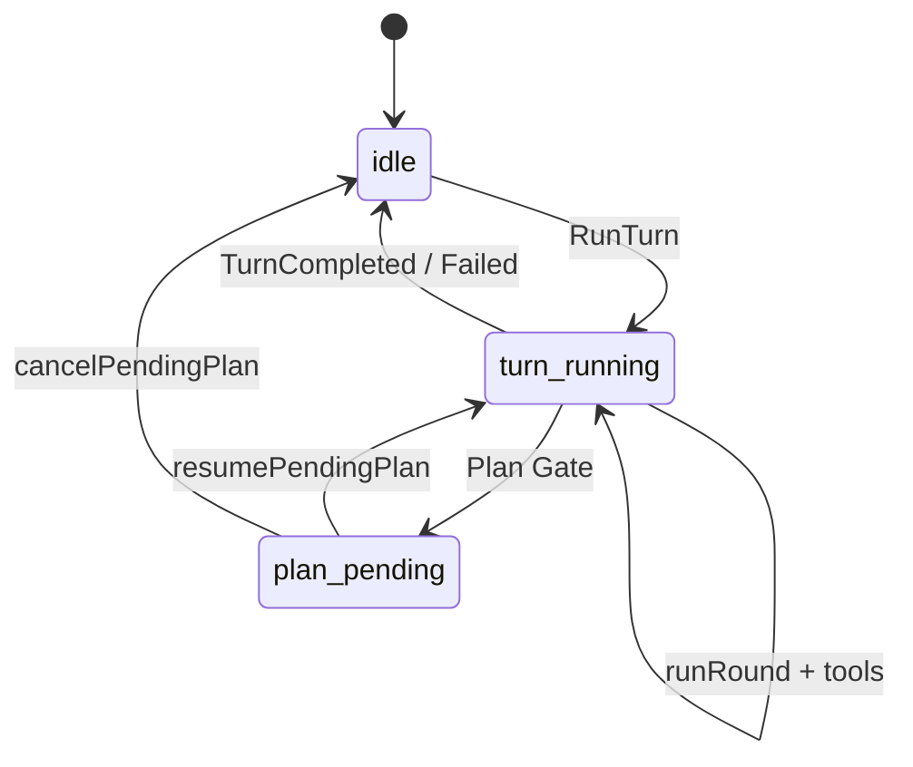
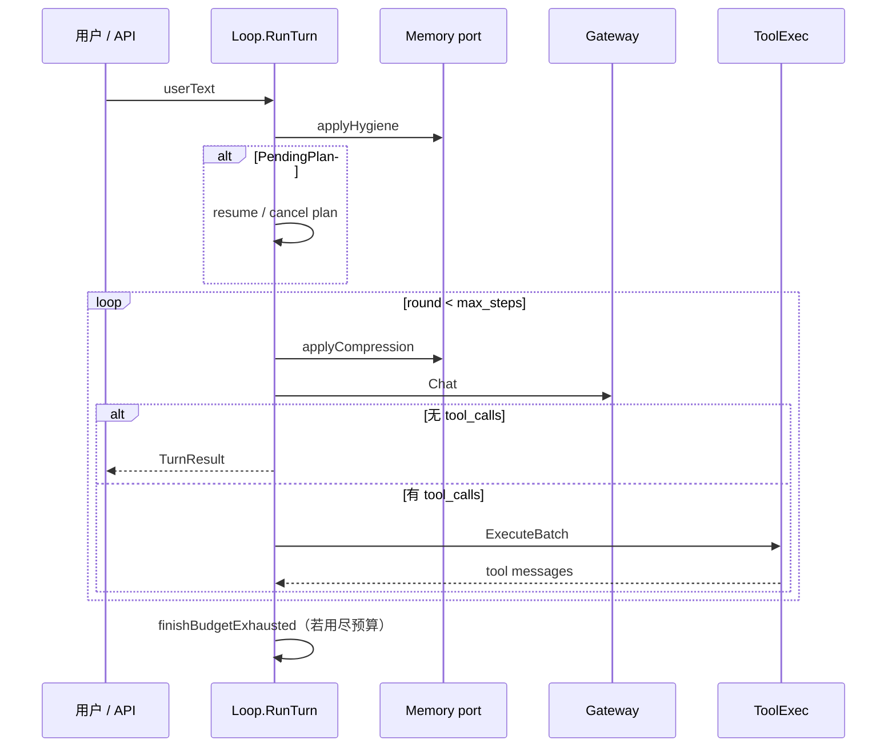

# L4 — Agent 循环

> 更新：2026-07-20。Hermes 对照：[Agent 循环](https://hermes-agent.nousresearch.com/docs/zh-Hans/developer-guide/architecture)。  
> 验收手册：[agent-loop-verification.md](./agent-loop-verification.md)

## 文档概述

本文档是 **Agent Loop（ReAct 对话编排）** 的唯一实现说明（SSOT），说明 `Agent.Run` / `Loop.RunTurn` 的设计原理、执行时序、`internal/agent` 模块划分、会话状态与配置项。适用于维护 `geegoo chat`、HTTP runtime、子 Agent 委托等对话路径；确定性盘前流程见 [workflow-engine.md](./workflow-engine.md)。

GeeGooAgent 的对话编排引擎：**Observe → Plan → Act → Update**，直到无 `tool_calls` 或达到 `max_steps`。

> **Kernel vs Cognition**：Loop 是控制平面；Ranker / Evaluator / PlanPolicy 在 `internal/cognition`，经 `SetCognition` 注入。定稿：[agent-runtime-architecture.md](../../agent-runtime-architecture.md)

## 目录

1. [总览](#1-总览)
2. [实现原理](#2-实现原理)
3. [执行流程](#3-执行流程)
4. [功能模块](#4-功能模块)
5. [配置与运维](#5-配置与运维)

---

## 1. 总览

### 入口

```go
// internal/agent/agent.go
func (a *Agent) Run(
    ctx context.Context,
    session *runtime.Session,
    userText string,
    toolCtx tools.Context,
    schemas []llm.ToolSchema,
) runtime.TurnResult
```

`Agent` 统一 CLI chat、HTTP `runtimeapi`、子 Agent 的调用面；核心在 `Loop.RunTurn`。

### 调用链

```text
L5  chatrepl / runtimeapi
        │
        ▼
L4  Agent.Run → Loop.RunTurn
        │
        ├── Gateway.Chat（L1）          ← 「Planner」逻辑在此
        ├── ToolExec → Executor（L4）→ Registry（L2）
        ├── Memory port 压缩 / recall（L3）
        └── Cognition 注入
```

### 与 Workflow 的分工

| 维度 | ReAct（本页） | [Workflow](./workflow-engine.md) |
|------|---------------|----------------------------------|
| 编排者 | LLM 选 Tool | `workflow.Runner` 硬编码步骤 |
| 适用 | `geegoo chat`、HTTP runtime | `geegoo run pre_market` 等 |
| 恢复 | PendingPlan、历史消息 | checkpoint + Working |
| 共享 | `ToolExec`、`Registry`、`Gateway` | 同左 |

---

## 2. 实现原理

### 2.1 Kernel 拥有 Loop

- `Loop.RunTurn` 是唯一状态机：何时调 LLM、执行 Tool、结束。
- Python Advisor 只返回 suggestion，不写 session、不调 tool。

### 2.2 Cognition ≠ Kernel

| 面 | 职责 | 包 |
|----|------|-----|
| Kernel | 轮次、Tool 派发、Plan 挂起、压缩、事件 | `internal/agent` |
| Cognition | 排序、质量评估、Plan 确认语义 | `internal/cognition` |

经 `SetCognition` 注入；默认 `AcceptAllEvaluator`、`IdentityRanker`、`DefaultPlanPolicy`。

### 2.3 ToolExec 双路径复用

`ToolExec` 同时服务 ReAct Loop 与 Workflow Runner，共用超时、并行、Approval、Plan Gate。

### 2.4 Session 与回合状态

消息经 `runtime.Session` → `chatsession` 持久化；Loop 不直接碰 SQLite。Working/Evidence 由 Tool 更新，经 `tools.Context.StateStore` 传递。

Chat **没有**独立的 `SessionStatus` 枚举；状态由 Session 字段 + metadata 表达。

| 情形 | 标志 | 说明 |
|------|------|------|
| 正常对话 | `PendingPlan == nil` | 每轮 `RunTurn` 走 ReAct |
| Plan 挂起 | `session.PendingPlan` 非空 | mutating 工具待用户 `y`/`n`；metadata 可恢复 |
| 回合失败 | `TurnResult.Failed` | LLM/ctx 错误；emit `TurnFailed` |
| 预算耗尽 | `finishBudgetExhausted` | 无 tool 的阶段性总结 |
| 压缩血缘 | `LineageChain` | `/session` 或 `inspect --session` 查看 |



HTTP/TUI 对外字段：`plan_pending`（见 [runtime-clarify.md](./runtime-clarify.md)）。Workflow run 的 checkpoint 状态见 [workflow-engine.md §Run 生命周期](./workflow-engine.md#run-生命周期)。

### 2.5 可取消与可观测

- `context.Context` 贯穿 LLM 与 Tool；Ctrl+C 中断当前回合。
- `SetProgress` → UI / NDJSON；`EventBus` → `TurnStarted` / `TurnCompleted` 等审计事件。

### 2.6 安全默认值

Plan Gate（mutating 先确认）、Schema 校验、Chat 工具隔离、`delegate_task` 禁止嵌套。

### 2.7 预算、压缩、Evaluator

- `max_steps` 限制轮次；耗尽时 `finishBudgetExhausted` 做阶段性总结。
- Memory port 在 hygiene（~85%）与每轮 LLM 前（~50%）压缩；血缘见 `lineage`。
- `eval_max_retries`（0–1）：Evaluator 建议重试时追加 hint 再跑一轮。

### 2.8 Planner 与 Executor（概念 → 代码）

Go 实现**无独立 Planner/Executor 包**：

| 概念 | Go 落点 |
|------|---------|
| **Planner** | `loop_round.callLLM` + `Gateway.Chat`；上下文由 `chatprompt` + `session.LLMMessages` 组装 |
| **Executor** | `ToolExec.ExecuteBatch` → `runtime.Executor` → `Registry.Execute` |

Planner 用的 Gateway 与 `get_mcp_analysis` Tool 调用的分析 LLM 分工不同：前者编排综合，后者技术面深度分析（Tool 返回结果，Planner 不重复编造）。

---

## 3. 执行流程

> 代码：`loop.go`（`RunTurn`）、`loop_round.go`（`runRound`）。

### 3.1 时序总览



### 3.2 RunTurn 阶段

**Phase 0 — 初始化**：AppendMessage(user)、`turn_start`、`applyHygiene`。

**Phase 1 — Pending Plan**：`y`/`确认` → `resumePendingPlan`；`n`/`取消` → `cancelPendingPlan`；其他 → 丢弃 PendingPlan。

**Phase 2 — ReAct 主循环**（`runRound`）：

```text
applyCompression → withBudgetWarning → SanitizeMessages → Gateway.Chat
  ├─ 无 tool_calls → finalizeReply
  └─ 有 tool_calls → intercept → ToolExec.ExecuteBatch → append tool msgs
        └─ Plan Gate? → PendingPlan + plan_proposed
```

回合结束：`tryEvalRetry`（可选）或 `TurnCompleted`。

**Phase 3 — 预算耗尽**：`finishBudgetExhausted` + 无 tool 的终局 LLM 调用。

### 3.3 Tool 执行

```text
ToolExec.ExecuteBatch
  → timeout / parallel / delegate_sem
  → ApprovalGate / plan_gate / hooks
  → Executor → Registry.Execute
```

### 3.4 子 Agent

`delegate_task` / `delegate_tasks` → `SubAgent` 独立 Session、`sub_agent_max_steps`、禁止嵌套 delegate。

### 3.5 事件

| 层级 | 示例 |
|------|------|
| Progress | `turn_start`, `tool_done`, `eval_retry`, `turn_complete` |
| NDJSON | `schema_version: 1`（`runtime/agent_events.go`） |
| EventBus | `TurnStarted`, `TurnCompleted`, `TurnFailed` |

HTTP clarify / plan 协议：[runtime-clarify.md](./runtime-clarify.md)。

---

## 4. 功能模块

### 4.1 关系图

```text
Agent (agent.go) → Loop (loop.go)
  ├─ loop_round / loop_plan / loop_compress / loop_budget / loop_reply / loop_stream
  ├─ loop_tools → ToolExec (tool_exec.go) → Executor (runtime) → Registry (tools)
  ├─ SubAgent (subagent.go) + delegate_tool.go
  └─ ReportSynthesizer (synthesis.go) — Workflow 用
```

### 4.2 `internal/agent` 文件职责

| 文件 | 职责 |
|------|------|
| `loop.go` | `RunTurn`、Evaluator 重试、EventBus |
| `loop_round.go` | `runRound`、`callLLM`、`applyToolRound` |
| `loop_plan.go` | PendingPlan 恢复/取消 |
| `loop_tools.go` | `executeToolCalls` |
| `loop_compress.go` | hygiene / compression + lineage |
| `loop_budget.go` | 预算耗尽终局 |
| `loop_reply.go` | `[BUDGET]` 临时提示 |
| `loop_stream.go` | 流式 `stream_delta` |
| `plan_gate.go` | mutating 判定 |
| `tool_intercept.go` | Chat 工具兜底 |
| `tool_exec.go` | 并行、超时、Plan Gate（**Workflow 共用**） |

### 4.3 跨包协作

| 包 | 关系 |
|----|------|
| `cognition` | `SetCognition` 注入 Ranker / Evaluator / PlanPolicy |
| `runtime` | Session、Executor、TurnResult |
| `llm` | Gateway、SanitizeMessages、cache breakpoints |
| `memport` / `prompt` | 压缩与 recall |
| `chatprompt` | 稳定 System prompt |
| `tools` | Registry、Context、ValidateArguments |
| `app` | 依赖组装、`wireCognition` |

### 4.4 入口（L5 → L4）

| 入口 | 路径 |
|------|------|
| `geegoo chat` | `chatrepl` → `Agent.Run` |
| HTTP | `runtimeapi` → `Agent.Run` |
| `delegate_task` | `SubAgent` 内嵌 `Loop.RunTurn` |
| Workflow | `Runner` → `ToolExec()`（不经 `RunTurn`） |

### 4.5 测试

```bash
go test ./internal/agent/... ./internal/verify/...
```

关键：`loop_plan_test`、`loop_compress_test`、`loop_eval_retry_test`、`verify agent-loop --offline`。

---

## 5. 配置与运维

### 配置（`config.json` agent 段）

| 字段 | 默认 | 说明 |
|------|------|------|
| `max_steps` | 80 | LLM↔tool 轮数上限（最大 90） |
| `sub_agent_max_steps` | 20 | delegate 上限（最大 40） |
| `tool_max_parallel` | 4 | 单轮并行 tool |
| `delegate_max_parallel` | 3 | 并行 delegate |
| `tool_timeout_sec` | 120 | 单次 tool 超时 |
| `plan_gate` | true | mutating 先确认 |
| `eval_max_retries` | 0 | Evaluator 重试（最大 1） |
| `profiles` | — | 情景补丁 |

### 命令

```bash
geegoo verify agent-loop --offline   # 12 项 parity，无需 config
geegoo verify agent-loop
geegoo inspect --quick
geegoo chat --message "..." --output-format ndjson --cli
```

### 延伸阅读

- [agent-loop-verification.md](./agent-loop-verification.md) — 验收步骤
- [workflow-engine.md](./workflow-engine.md) — 确定性工作流
- [../../entrypoints.md](../../entrypoints.md) — CLI / HTTP 入口
- [../L1-model-gateway/gateway.md](../L1-model-gateway/gateway.md) — LLM 调用链
