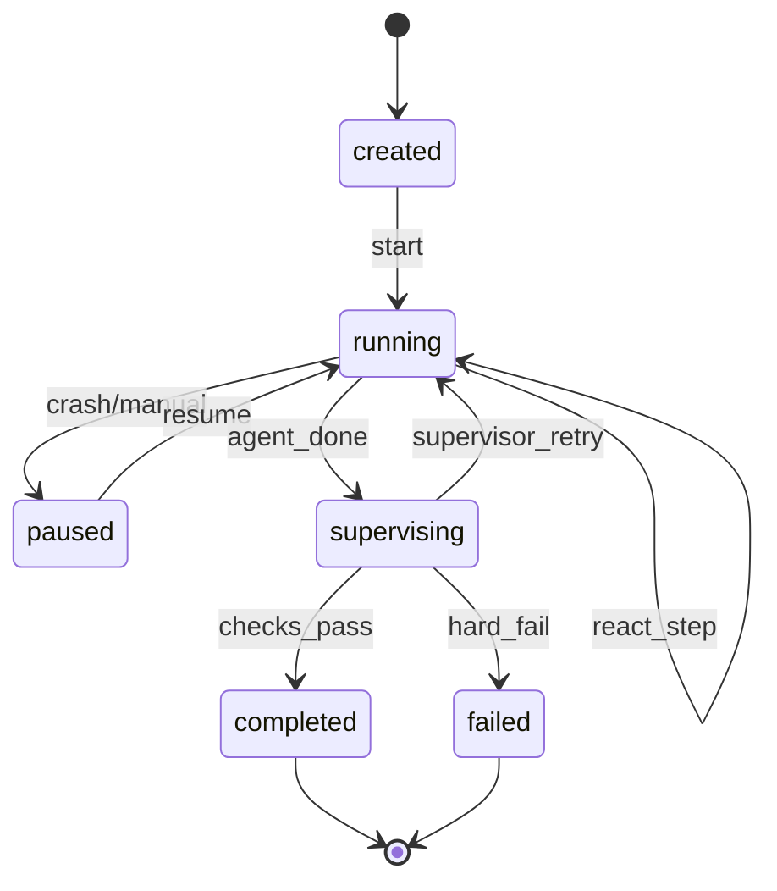

# L4 — StateMachine（Session）

## 职责

管理单次 Run 的生命周期与合法状态迁移。

## 状态图




## Session 模型

```python
@dataclass
class Session:
    id: str
    skill_name: str
    status: SessionStatus
    step: int
    created_at: datetime
    updated_at: datetime
    messages: list[Message]
    step_records: list[StepRecord]
    agent_done: bool
    error: str | None
```

## SessionManager

```python
class SessionManager:
    def create(self, ctx: RunContext) -> Session: ...
    def resume(self, session_id: str) -> Session: ...
    def persist(self, session: Session) -> None: ...  # → StateStore + Checkpoint
    def finalize(self, session: Session, status: SessionStatus) -> None: ...
```

## 持久化路径

```text
{output_dir}/{YYYYMMDD}/sessions/{session_id}.json
```

## resume 行为

1. 从 StateStore 加载最新 Checkpoint
2. 恢复 `step`、`messages` 尾部、`working`
3. 注入补跑 prompt（Supervisor 触发时）

## MVP

create / persist / resume / completed / failed。