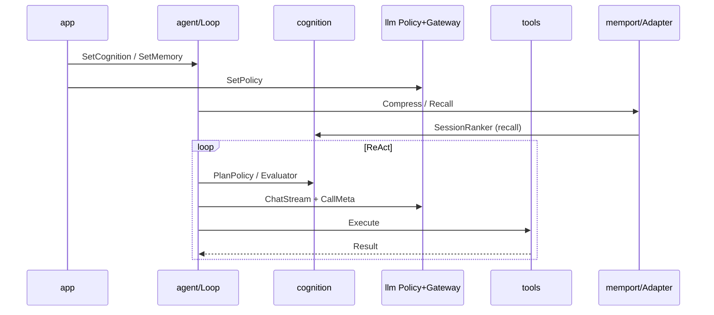

# GeeGooAgent 架构

本页是 GeeGooAgent 内部结构的顶层导图。用它在代码库中定位自己，然后深入各子系统专项文档了解实现细节。

> 对照 [Hermes Agent 架构](https://hermes-agent.nousresearch.com/docs/zh-Hans/developer-guide/architecture)。完整对比见 [`../../deploy/hermes-parity-comparison.md`](../../deploy/hermes-parity-comparison.md)。文档总索引：[README.md](./README.md)。

## 定位

**GeeGoo Agent** 是股票分析专用的自托管 Agent：

```text
Agent = L4 Runtime + L0 Infrastructure + L5 Skill Pack
```

长期产品视角下，它首先是 **Agent Runtime（Go 控制面）**。架构定稿与包边界见：

- **[agent-runtime-architecture.md](./agent-runtime-architecture.md)** — Agent OS 架构  
- **[backlog.md](./backlog.md)** — 唯一待办（Dashboard、向量库等）

实现状态 → **[implementation-status.md](./implementation-status.md)**。

**不是什么**：自动交易系统、Airflow 式 pipeline、Coding Agent（无任意 Bash）。MVP 不依赖外部向量库；Session SSOT 与 Memory port 区分见 [agent-runtime-architecture.md](./agent-runtime-architecture.md) §7。

## 六层模型

```text
L5 Application   Skill、CLI、触发、Rules
L4 Runtime       ReAct、Workflow、Supervisor、Cognition（策略面）
L3 Memory        Session SSOT、Memory port、Working、Evidence、Compaction
L2 Tools         Registry、MCP Clients、Toolsets
L1 Gateway       LLM Provider、重试
L0 Infrastructure SQLite、EventBus、Scheduler、Sandbox
```

| 层 | 文档 |
|----|------|
| L5 | [layers/L5-application/](./layers/L5-application/) |
| L4 | [layers/L4-runtime/](./layers/L4-runtime/) |
| L3 | [layers/L3-memory/](./layers/L3-memory/) |
| L2 | [layers/L2-tools/](./layers/L2-tools/) |
| L1 | [layers/L1-model-gateway/](./layers/L1-model-gateway/) |
| L0 | [layers/L0-infrastructure/](./layers/L0-infrastructure/) |

依赖规则：下层不知上层业务；`internal/infra` 不依赖 `workflow` / `tools`。

依赖规则：下层不知上层业务；`internal/infra` 不依赖 `workflow` / `tools`。  
Kernel 与 Cognition 分离、Memory port 与 Session SSOT 分离 → [agent-runtime-architecture.md](./agent-runtime-architecture.md)。

## 系统概览

```text
┌─────────────────────────────────────────────────────────────────────┐
│                        Entry Points                                  │
│  CLI (cmd/geegoo)          HTTP (cmd/agent-runtime :3400)            │
│  chat / run / scheduler    /v1/chat/*  /health                       │
└──────────────────────────────┬──────────────────────────────────────┘
                               ▼
┌─────────────────────────────────────────────────────────────────────┐
│                   App (internal/app) — 依赖组装                        │
│  LoadFromConfigPath → RebuildGateway → wireChatMemory                │
│                    → wireCognition → wireRecallRanker                │
│                    → tools.RegisterAll(Deps{Memory: ChatMemory})      │
└──────────────────────────────┬──────────────────────────────────────┘
                               ▼
┌─────────────────────────────────────────────────────────────────────┐
│              Agent Kernel (internal/agent)                            │
│  Loop.RunTurn — 控制平面：权限、超时、取消、plan gate、预算            │
│  SetCognition(Bundle)    SetMemory(memport.Port)                     │
└───────┬─────────────────┬─────────────────┬─────────────────────────┘
        │                 │                 │
        ▼                 ▼                 ▼
┌───────────────┐ ┌───────────────┐ ┌───────────────────────────────┐
│ cognition     │ │ runtime       │ │ workflow                      │
│ Ranker        │ │ Session       │ │ pre_market / intraday /       │
│ Evaluator     │ │ Executor      │ │ post_market + Supervisor      │
│ PlanPolicy    │ │ events        │ └───────────────────────────────┘
│ (+Advisor opt)│ └───────────────┘
└───────┬───────┘
        │ optional HTTP
        ▼
 services/cognitive   Python Advisor（suggestion-only，默认关）

┌─────────────────────────────────────────────────────────────────────┐
│                     Runtime 子系统（Go）                              │
│  tools (~82) + MCP    chatsession (SSOT)    memport + memory.Adapter │
│  llm: Policy → Gateway → providers                                   │
└─────────────────────────────────────────────────────────────────────┘
```

完整目录树 → [repo-layout.md](./repo-layout.md)。

## 数据流

### CLI Chat 会话

```text
用户输入 → chatrepl.runTurn()
  → Chat.SyncChatSystemPrompt() + RuntimeMessages()
  → Agent.Run(ctx, session, text, toolCtx, schemas)
    → [可选] Loop 压缩经 memport.Compress（memory.Adapter + prompt.Compressor）
    → Loop.RunTurn：
        PlanPolicy 门控 mutating tools（plan gate）
        Gateway.ChatStream(ctx + CallMeta{TaskKind: chat})
          → Policy.Decide → provider（重试，ctx 可取消）
        tool_calls → ToolExec → Registry（recall 经 deps.Memory.Recall + SessionRanker）
        回合末 Evaluator（cognition，默认 accept）
    → 循环直到无 tool_call
  → 渲染 → chatsession 持久化（Session SSOT）
```

启动时 `app.LoadFromConfigPath` 已注入：`SetCognition`、`SetMemory(ChatMemory)`、`Gateway.SetPolicy(ConfigPolicy+ComplexityPolicy)`。

### Pre-market Workflow

```text
geegoo run pre_market
  → App.RunSkill("pre_market")（从 skills registry 查 Spec）
  → Workflow.Run(phaseA, perStock)
    → 每步 processStep：Execute → Working.Apply → write_execution_log → checkpoint
    → 按 CompletedStepKeys 幂等跳过（resume 不因 bot 列表变化而错位）
    → Recoverable 错误自动重试 1 次；Terminal 直接 fail
  → finishWithSupervisor：Engine.Verify → verdict（pass/recoverable/terminal）
  → 报告生成：report.Synthesizer（CallMeta TaskSynthesis，经 Policy → Gateway）
    → result/confidence 规则锁定；reason/suggestion/summary 由 LLM 综合
    → LLM 失败回退规则版，不阻塞
  → create_pre_market_report 入库 + save_local_report 留档
```

### Scheduler 任务

```text
geegoo scheduler run
  → LoadJobs(jobs.json)（默认 pre_market 工作日 08:00）
  → robfig/cron 注册 enabled jobs
  → tick → runJob → App.RunSkill(skill) → supervisor verdict
  → pass：不动
  → recoverable/terminal：指数退避重试（30m → 60m，最多 2 次）
  → 记录 last_run/last_verdict 到 jobs.json
  → SIGTERM/SIGINT 优雅停机
```

### HTTP Runtime

```text
POST /v1/chat/completions（Bearer + X-MCP-Token）
  → runtimeapi.chatCompletions
  → Agent.Run(r.Context(), session, lastUser, ctx, schemas)
  → 返回 OpenAI 兼容 JSON
```

## 主要子系统

### Agent OS 控制面

定稿详见 [agent-runtime-architecture.md](./agent-runtime-architecture.md)。代码落点：

| 组件 | 包 | 注入点 |
|------|-----|--------|
| **Kernel** | `internal/agent` | `Loop.RunTurn`；`SetCognition` / `SetMemory` |
| **Cognition** | `internal/cognition` | Ranker / Evaluator / PlanPolicy；可选 `AdvisorClient` → `services/cognitive` |
| **Memory port** | `internal/memport` + `memory.Adapter` | `Recall` / `Compress` / `Store(evidence)`；recall 排序经 `SessionRanker` |
| **Model Policy** | `internal/llm/policy.go` | `ConfigPolicy` + `ComplexityPolicy` → `Gateway.SetPolicy` |
| **组装** | `internal/app` | `wireChatMemory`、`wireCognition`、`wireRecallRanker`、`buildModelPolicy` |

`tools` 不 import `cognition`；边界由 `archboundaries` + CI 校验。

### Agent 循环

`Agent.Run` 是平台无关核心（CLI、HTTP runtime 共用）。`Loop` 拥有 ReAct 状态机；策略经 `cognition.Bundle` 注入，默认 Go 实现与历史行为等价。支持 `context.Context` 取消与 plan gate。

### Prompt 系统

`internal/chatprompt/prompt.go` 提供稳定 system prompt（人格 + Tool 路由规则 + 记忆规则）。`ChatSession.RuntimeMessages()` 在最后一条 user message 前注入动态 Tool 活动 context（user 角色），**system message 跨轮字节不变**，保 DeepSeek/OpenAI 前缀缓存命中率。DeepSeek thinking 模式通过 `llm/openai.go` 的 `thinking`/`reasoning_effort`/`reasoning_content` 解析接入。

`internal/prompt/compressor.go` 在回合开始（默认 85% hygiene）与每轮 LLM 调用前（默认 50%）按 token 阈值触发 Hermes-style 四阶段压缩；`context_length` 可按当前模型自动解析。详见 [`layers/L3-memory/compaction.md`](layers/L3-memory/compaction.md)。

### Model Policy 与 Provider

`internal/llm/policy.go`：`ConfigPolicy`（chat/compress/synthesis 温度与 max_tokens）+ `ComplexityPolicy`（`TaskComplex` 抬 token；默认不因 tool 数量误抬）。  
`Gateway` 经 context `CallMeta` 应用 Policy，再调 `presets.go` 解析的 3 个 provider（DeepSeek/OpenAI/Minimax）。

### 工具系统

`internal/tools/registry.go` 中央注册表，**82** 个工具（catalog HTTP 转发 + bespoke 手写）。完整树形图：[layers/L2-tools/tools-status.md](./layers/L2-tools/tools-status.md)。关键能力：
- `ApprovalGate`：`create_/update_/delete_/switch_` 工具在交互式 chat 且未确认时 Skip；workflow 路径不受影响
- `ClassifyHTTPPayload`：API 返回 code=100 但 data 空 → `StatusSkip` + 数据缺口 note（避免「看似成功但数据不可用」）
- `Result.Meta`：每次 HTTP 工具带 `api_code/duration_ms`
- `catalog.NeedsMCPToken`：除 search_code/get_index_signals/get_signal_combinations 外默认注入 mcp_token

### 会话与 Memory

- **Session SSOT**：`chatsession` + SQLite（消息、pending plan、轨迹）  
- **Memory port**：`memport.Port` + `memory.Adapter`（压缩、跨会话 recall、evidence 写入）  
- **recall tool**：`deps.Memory.Recall` → 可选 `SessionRanker` → `agent.RankRecallHits` → cognition Ranker  

`geegoo migrate` 文件 JSON → SQLite。FTS5 支持跨会话检索。

### Evidence Store

`internal/memory/evidence.go`：每条工具结果落 `evidence_records`（id/run_id/session_id/tool/source/payload_hash/summary/observed_at/payload_json）。报告只存 evidence IDs；`VerifyPayload` 重新 hash 校验。这是 GeeGoo 相对 Hermes 的差异化能力——报告可审计、可追溯。

### Workflow + Supervisor

`internal/workflow/runner.go` 确定性步骤执行。`RunFrom` 按 `CompletedStepKeys`（命名 step key）幂等跳过，不按扁平编号——bot 列表变化不会导致 step 错位。`supervisor.go` 跑后验收：phase done、本地 md 存在、API report_id/bot 字段、evidence_refs；输出 verdict `pass`/`recoverable`/`terminal`。recoverable 列出 MissingSteps 可补跑；terminal（status=failed）停手告警。非交易日 verdict=pass。

### Report Synthesis

`internal/report/synthesis.go`：LLM 只综合 reason/suggestion/summary，**严禁编造数据**，prompt 强制引用 evidence ID，reason ≥80 字。`result`/`confidence` 锁定规则（attitude→result，evidence 数→confidence），LLM 不能翻转决策。LLM 失败回退规则版，不阻塞 workflow。

### Skills

`internal/skills/registry.go` + `loader.go`：`geegoo run <skill>` 从 registry 查 Spec。`pre_market`、`intraday`、`post_market` 均已注册步骤与资源目录。

详见 [layers/L5-application/skills.md](./layers/L5-application/skills.md)。Tool 体系见 [layers/L2-tools/README.md](./layers/L2-tools/README.md)。

### Scheduler

`internal/scheduler/scheduler.go`：robfig/cron/v3 驱动。jobs.json 存 `{name, skill, cron, enabled, last_run, last_verdict}`。tick 跑 `App.RunSkill`，按 supervisor verdict 决定是否退避重试。`geegoo scheduler run` 长驻，SIGTERM 优雅停。替代外部 systemd timer，能在 agent 内做「盘前失败 → 30 分钟后重跑」。

### Cutover 验收

`internal/verify/verify.go` + `cmd/geegoo/verify.go`：`geegoo verify --codes <list> [--date <D>]` 拉 `getStockDailyReports`，逐条检查 bot_id/bot_name/bot_type 非空、result/confidence/suggestion 枚举合法、reason ≥80 字、evidence_refs 非空，输出字段完整率矩阵，失败 exit 1。

## 与 Hermes / Claude Code 对照

| 维度 | Hermes | Claude Code | GeeGoo Agent |
|------|--------|-------------|--------------|
| 扩展 | Skill 目录 | Rules + Tools | Skill Pack + Rules |
| 循环 | 隐式 | 显式 Loop | ReAct + `max_tool_rounds` |
| 工具 | 隐式 shell | Read/Bash/Grep | 82 个 Typed Tools（无 Bash） |
| 记忆 | 对话+日志 | 上下文+Grep | Session SSOT + Memory port + Evidence（无向量库） |
| 持久化 | 文件+日志 | 无 Agent DB | SQLite WAL + evidence |
| 质检 | 无 | 用户确认 | Supervisor + `geegoo verify` |
| 定时 | 外部 Gateway cron | — | 内置 `geegoo scheduler` |

## 设计原则

| 原则 | 实践 |
| --- | --- |
| Prompt 稳定性 | system message 对话中字节不变；动态 context 作为 user-side 注入；除 `/think`/`/model` 外不破坏缓存 |
| 可观测执行 | 每次工具调用通过 `EmitProgress` 对用户可见（chatui spinner + 工具预览） |
| 可中断 | `context.Context` 贯穿 Agent→Gateway→Provider→Tool；Ctrl+C 中断进行中回合，下回合可继续 |
| 平台无关核心 | 单一 `Agent.Run` 服务 CLI / HTTP / workflow；Cognition / Memory 可注入替换 |
| LLM 不当数据源 | 报告 result/confidence 规则锁定；LLM 只综合 evidence 已有数据；失败回退规则版 |
| 报告可审计 | 每条结论可追溯到 evidence_records 原始 payload + hash |
| 幂等 resume | 按 step key 跳过，不按编号；bot 列表变化不导致错位 |
| 质检驱动 | supervisor verdict 决定 pass/recoverable/terminal；recoverable 自动补跑；scheduler 据此退避重试 |
| LLM 编排 Tool 执行 | 禁止 Agent 手写 HTTP / 任意 shell |
| 定时模式禁 Bot CRUD | scheduled workflow 不暴露 `create_*_bot` |

## 一次 Run 生命周期



## 文件依赖链

```text
infra/db.go + schema.sql
       ↑
chatsession/, memory/ (Adapter, evidence, working)
memport/  （接口，无 memory/tools 依赖）
       ↑
llm/policy.go → gateway.go → presets/openai
cognition/  （无 agent/tools 依赖）
       ↑
agent/loop_*  → runtime/executor
       ↑
app/app.go  （wireChatMemory, wireCognition, wireRecallRanker, RegisterAll）
       ↑
cmd/geegoo/* + cmd/agent-runtime/*
```

工具注册：`app.LoadFromConfigPath` → `tools.RegisterAll(Deps{Memory: ChatMemory})`，早于 Agent 首轮对话。

## Tools 与 Skills（速览）

GeeGooAgent 能力由 **Skill（任务包）** 与 **Tool（原子 API）** 两层协作：

| 层 | 数量 | 文档 |
|----|------|------|
| 已注册 Tool | **82** | [layers/L2-tools/tools-status.md](./layers/L2-tools/tools-status.md) |
| 内置 Skill | 3（pre_market 完整） | [layers/L5-application/skills.md](./layers/L5-application/skills.md) |
| Chat toolset | 6 组 | [layers/L2-tools/toolsets.md](./layers/L2-tools/toolsets.md) |

- **Chat**：LLM 经 ReAct 调用 toolset 白名单内 Tool  
- **Workflow**：`geegoo run pre_market` 硬编码步骤  

Tool 文档入口 → **[layers/L2-tools/README.md](./layers/L2-tools/README.md)**

## 推荐阅读顺序

如果你是第一次接触代码库：

1. **本页** — 六层导图与数据流  
2. [agent-runtime-architecture.md](./agent-runtime-architecture.md) — **Agent OS 定稿**  
3. [implementation-status.md](./implementation-status.md) — 已实现 / 未实现  
4. [repo-layout.md](./repo-layout.md) — 目录与包对照  
5. [entrypoints.md](./entrypoints.md) — CLI / HTTP / Scheduler  
6. [layers/L4-runtime/agent-loop.md](./layers/L4-runtime/agent-loop.md) — ReAct 循环  
7. [layers/L2-tools/tools-status.md](./layers/L2-tools/tools-status.md) — Tool 运行态  
8. [backlog.md](./backlog.md) — 唯一待办  

深入代码：`internal/app/app.go` → `internal/agent/loop.go` → `internal/cognition/`
