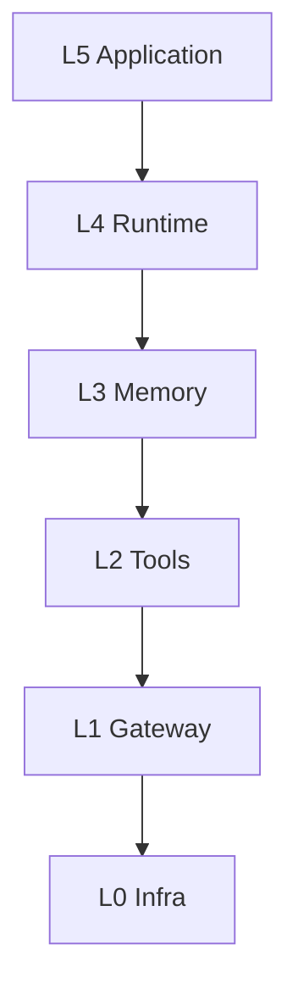
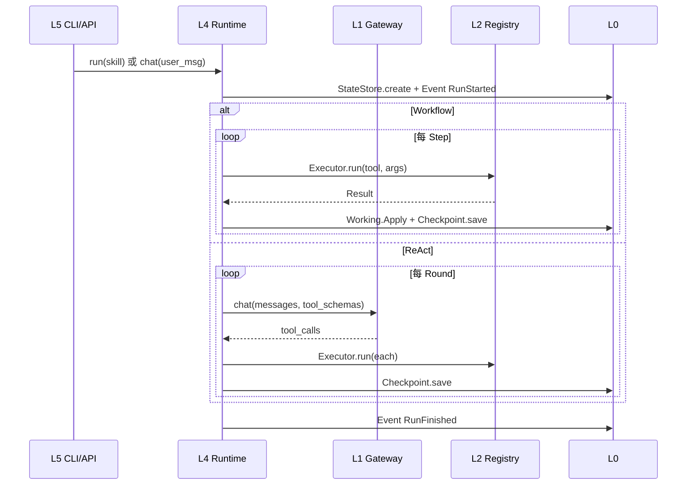

# 00 — 自托管 Agent 平台总览

## 一句话

**自托管 Agent** = 在你自己的机器/服务器上运行的、带 **Tool 调用能力** 的智能体进程：  
LLM 负责**决策**，Typed Tool 负责**执行**，Infrastructure 负责**可恢复与可观测**。

不是 Airflow 式固定 pipeline，不是超长 cron prompt，不是 Coding Agent（无任意 Bash）。

---

## 工程六层

```text
┌─────────────────────────┐
│ L5 Application          │  Skill Pack、CLI/HTTP、Rules、触发模式
└───────────┬─────────────┘
            ▼
┌─────────────────────────┐
│ L4 Agent Runtime        │  ReActLoop · WorkflowRunner · Session
└───────────┬─────────────┘
            ▼
┌─────────────────────────┐
│ L3 Memory               │  Session（对话）· Working（结构化状态）
└───────────┬─────────────┘
            ▼
┌─────────────────────────┐
│ L2 Tools                │  ToolRegistry · Catalog · External Clients
└───────────┬─────────────┘
            ▼
┌─────────────────────────┐
│ L1 Model Gateway        │  Provider 路由 · 重试 · Fallback · 限流
└───────────┬─────────────┘
            ▼
┌─────────────────────────┐
│ L0 Infrastructure       │  EventBus · StateStore · Checkpoint · Scheduler
└─────────────────────────┘
```



---

## 双 Runtime（必须同时设计）

| 模式 | 类名 | 何时用 | LLM 角色 |
|------|------|--------|----------|
| **Deterministic Workflow** | `WorkflowRunner` | 步骤可预先定义：定时报告、ETL、审批流 | 仅窄任务 synthesis（可选） |
| **ReAct Loop** | `ReActLoop` | 开放对话、探索性任务 | 每轮 plan → tool_calls |

```text
                    任务步骤是否可预先写死？
                              │
              ┌───────────────┴───────────────┐
             是                               否
              ▼                               ▼
     WorkflowRunner                    ReActLoop
     + manifest.yaml                   + tool 白名单
     + checkpoint 逐步                  + max_tool_rounds
```

**共用**：L2 Registry、L3 Working、L0 Checkpoint、同一 `Executor`。

GeeGooAgent 参考：`internal/workflow/runner.go` + `internal/runtime/react.go`。

---

## 一次 Run 生命周期



---

## 外部依赖决策（MVP 默认）

| 类型 | MVP 推荐 | 禁止（Phase 0–1） |
|------|----------|-------------------|
| Agent 状态 | 本地文件 `FileStateStore` | PostgreSQL / Redis |
| 向量记忆 | stub（返回空） | 强依赖 Milvus/Chroma |
| 调度 | systemd timer / cron 调 CLI | 进程内 APScheduler 守护 |
| LLM | OpenAI 兼容 API 经 Gateway | Runtime 直连 SDK |
| 沙箱 | HTTP allowlist | 任意 Shell Tool |

业务数据在**远端 HTTP API**；Agent 不直连业务 DB。

---

## 核心原则（10 条）

1. **LLM 编排，Tool 执行**
2. **Runtime 不直连模型** — 经 L1 Gateway
3. **Runtime 不手写 HTTP** — 经 L2 Tool
4. **事件驱动** — Tool 完成经 EventBus 通知观测层
5. **每步 Checkpoint** — 支持 `resume --session <id>`
6. **Working Apply** — Tool `Data` 结构化写入，prompt 只读 `Summary`
7. **scheduled 模式过滤 mutating Tool**
8. **dry-run** — mutating Tool 返回 `dry_run` 状态
9. **doctor** — 配置 + 出站连通性一键自检
10. **Skill 与 Runtime 分离** — Phase 3 起 manifest 驱动，少改核心代码

---

## 不是什么

- 不是 LangChain/LangGraph 应用（可借鉴概念，不作运行时依赖）
- 不是自动交易/自动删库系统（危险操作需 `interactive` + human confirm）
- 不是通用 Coding Agent（无 Dev Container、无 grep/read 任意文件，除非显式 Tool）
- 不是 Hermes 式「一个 2000 行 prompt 搞定一切」

---

## 与 Claude Code / Cursor Agent 对照

| 维度 | Claude Code | 本蓝图 Agent |
|------|-------------|--------------|
| 工具 | Read/Bash/Grep | 领域 Typed Tools |
| 循环 | 显式 | ReAct + max_rounds |
| 批量任务 | 弱 | WorkflowRunner 优先 |
| 持久化 | 会话内 | FileStateStore + Checkpoint |
| 扩展 | Rules | Skill Pack + manifest |

---

## 下一步

- 目录：[repo-layout.md](./repo-layout.md)
- 接口：[layers.md](./layers.md)
- 实现：[agent-build-guide.md](./agent-build-guide.md)
