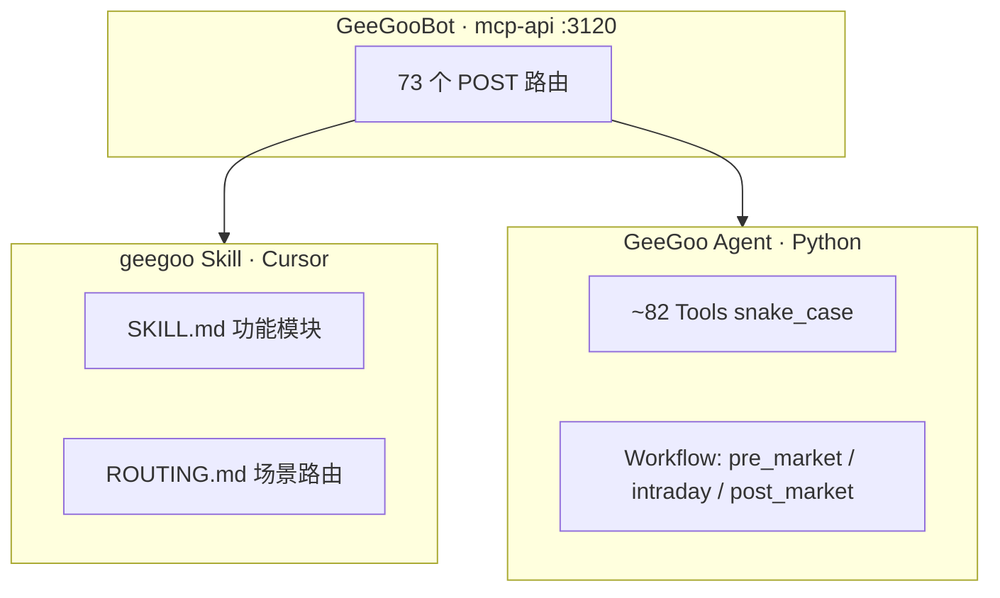

# GeeGooBot mcp-api 三层架构

## 总览

## 文档领域（12 个）

与 [interface-map.md](./interface-map.md) 一致：

| # | 领域 | 专题文档 | 说明 |
|---|------|----------|------|
| 1 | **common** | common.md | 认证、Bot 分类枚举、**账户持仓**、**Bot 运行日志** |
| 2 | **trading** | market/trading-data.md | 搜码、报价、信号、资金、交易日、逐笔等**行情** |
| 3 | **reports** | market/reports.md | **报告 Workflow**：待分析标的 + 三类报告 CRUD |
| 4 | **analyst** | analyst/agent-analyst.md | Prompt 模板、`getMCPAnalysis` |
| 5 | **strategy** | strategy/ | **生成 + 回测**（合并为一个领域） |
| 6–9 | **bot ×4** | bot/*.md | DCA / GRID / SmartTrade / HDG CRUD |
| 10–12 | **reminder ×3** | reminder/*.md | 三类提醒 CRUD |

## 命名变更（报告 Workflow）

| 旧名 | 新名（推荐） | 说明 |
|------|--------------|------|
| `/getUserBotCodes` | `/getReportBotCodes` | 返回待写报告的标的列表，**不是**通用 Bot 列表查询；旧路径仍兼容 |

GeeGoo Agent Tool **`get_report_bot_codes`** 调用 **`POST /getReportBotCodes`**；旧 HTTP 路径 `/getUserBotCodes` 仍兼容。

## geegoo Skill 模块 ↔ 领域

| SKILL.md 模块 | 主要领域 |
|---------------|----------|
| 股票技术面分析 | analyst |
| 策略生成 / 策略回测 | strategy |
| 各类 Bot / Reminder | bot / reminder |
| Workflow（盘前/盘中/盘后） | trading + **reports** |

## 文档 SSOT

1. **interface-map.md** — 接口 × Tool × Skill 总表  
2. **专题文档** — 参数与示例  
3. geegoo Skill、GeeGoo Agent 后续按总表对齐  

修改路由后：`python scripts/generate_interface_map.py`
